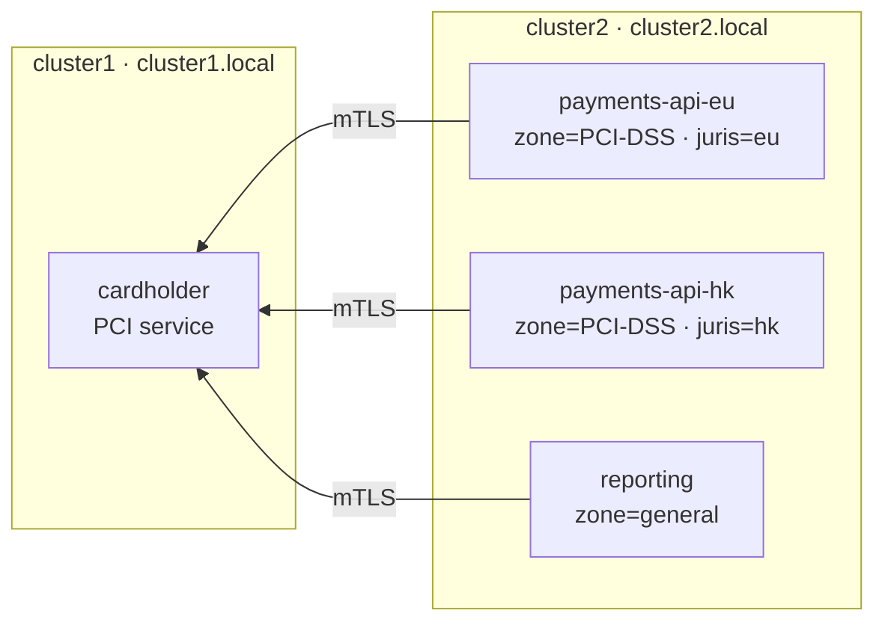
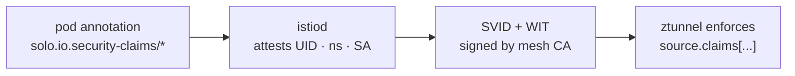
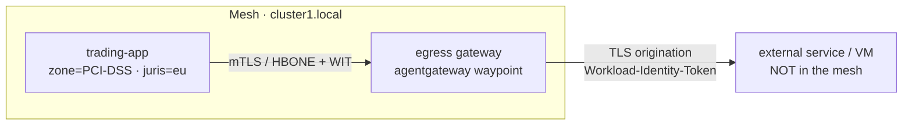
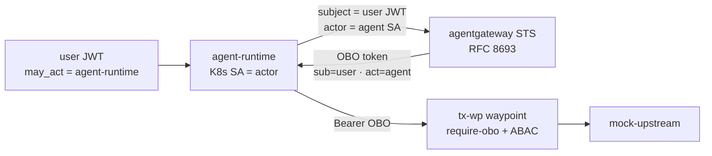

# Workload & Agent Identity, End to End — with Solo Istio Ambient + agentgateway

A hands-on workshop that builds up **five** identity capabilities of [Solo Istio](https://www.solo.io/products/solo-istio) ambient mesh and [agentgateway](https://agentgateway.dev), across two clusters in two trust domains.

The thread running through it: **mesh identity → attested claims → identity beyond the mesh → on-behalf-of**. We use a payments scenario — a PCI `cardholder` service, tenant clients in different jurisdictions, and an agent acting for a user — but nothing here is payments-specific. The same model applies to any workload or agent that needs a verifiable identity.

1. **Multi-cluster by labeling** — join a namespace to the mesh (it earns a SPIFFE identity), then make its services reachable cross-cluster with a single label.
2. **Identity-based authorization** — lock a service to a workload's SPIFFE identity, and hit the limit of service-account identity.
3. **Workload-identity claims in the SVID** — per-workload *attested* claims that authorize what the service account cannot (jurisdiction).
4. **Identity beyond the mesh (WIMSE WIT)** — propagate the signed identity *and* its claims to a **non-mesh** destination on egress; verifiable offline.
5. **On-behalf-of token exchange** — agentgateway swaps a user's token for an OBO token (`sub` + `act`), gated by **`may_act`**, then enforces request-level ABAC on the result.

| Cluster | Trust domain | Role |
|---|---|---|
| `$CLUSTER1` | `cluster1.local` | runs `cardholder` (the PCI service); hosts the egress gateway + token-exchange STS |
| `$CLUSTER2` | `cluster2.local` | runs the tenant clients |



---

## Prerequisites

This workshop assumes you already have **two clusters** running **Solo Istio in ambient mode**, federated under a **shared root CA** so they trust each other across distinct trust domains (`cluster1.local` and `cluster2.local`), plus the **enterprise agentgateway** controller installed (it provides the egress waypoint class, the workload-claim extraction, and the token-exchange STS).

If you need the base multi-cluster ambient setup first, follow [solo-io ambient multicluster workshop](https://github.com/rvennam/ambient-multicluster-workshop) and then come back here. The key bits this workshop relies on:

- Ambient mesh on both clusters (ztunnel for L4, agentgateway/Istio waypoints for L7).
- A shared root CA so SVIDs from `cluster1.local` and `cluster2.local` validate against the same root.
- `ENABLE_WORKLOAD_CLAIMS=true` on ztunnel **and** istiod, so pod annotations (`solo.io.security-claims/*`) are attested into the SVID. (Parts 3–5.)
- The enterprise agentgateway controller, which provides the `enterprise-agentgateway-waypoint` GatewayClass and the token-exchange STS at `enterprise-agentgateway.agentgateway-system.svc.cluster.local:7777`. (Parts 4–5.)

Set your two cluster contexts:

```bash
export CLUSTER1=cluster1   # UPDATE THIS — kube context for cluster1
export CLUSTER2=cluster2   # UPDATE THIS — kube context for cluster2
```

Clone this repo and `cd` into it — the commands below reference `./manifests` and `./scripts` from the repo root:

```bash
git clone https://github.com/rvennam/istio-agentgateway-identity-workshop
cd istio-agentgateway-identity-workshop
```

Local tooling: `kubectl`, `istioctl`, `jq`, `python3` with `pyjwt` + `cryptography` (`pip install pyjwt cryptography` — used by the Part 5 IdP helper and offline token decoding).

---

## Part 1 — Mesh & multi-cluster, by labeling

`cardholder` runs on **cluster1**. Watch it join the mesh, earn an identity, and become reachable from **cluster2** — all through labels, no gateways.

### Deploy the PCI service on cluster1 — not yet in the mesh

```bash
kubectl --context=${CLUSTER1} create namespace tenant-payments
kubectl --context=${CLUSTER1} apply -f ./manifests/cardholder.yaml
```

### Add the namespace to the mesh

`istio.io/dataplane-mode=ambient` enrolls every pod in the namespace into the ambient mesh — no sidecars, no restarts.

```bash
kubectl --context=${CLUSTER1} label ns tenant-payments istio.io/dataplane-mode=ambient
```

### It now has a cryptographic SPIFFE identity

Joining the mesh gave `cardholder` a short-lived X.509 SVID. The helper decodes the identity embedded in the workload's certificate:

```bash
./scripts/show-svid.sh ${CLUSTER1} tenant-payments cardholder
```

```
  SPIFFE id : spiffe://cluster1.local/ns/tenant-payments/sa/cardholder
  CLAIMS    : (none — identity only)
```

✅ The workload has a mesh-issued, cryptographic identity — no secrets, no config.

### Deploy the tenant clients on cluster2

Two `payments-api` pods share **one service account** (`payments-api`) → they will get an *identical* SPIFFE identity. `reporting` is a separate, non-PCI tenant. (The `zone` claim is set in the YAML; we add `jurisdiction` in Part 3.)

```bash
kubectl --context=${CLUSTER2} apply -f ./manifests/tenant-clients.yaml
```

### cardholder is still local to cluster1

From cluster2 it isn't reachable yet — the call can't resolve cross-cluster.

```bash
./scripts/tenant-to-cardholder.sh
```

```
  tenant-payments/payments-api-eu  (sa:payments-api zone:PCI-DSS juris:eu)  -> http 000 [DENY/unreachable]
  tenant-payments/payments-api-hk  (sa:payments-api zone:PCI-DSS juris:hk)  -> http 000 [DENY/unreachable]
  tenant-analytics/reporting       (sa:reporting   zone:general juris:eu)   -> http 000 [DENY/unreachable]
```

### Make it available multi-cluster

`solo.io/service-scope=global` makes the **`cardholder`** service a global, cross-cluster service over mesh mTLS — across trust domains, no gateways. Scope it to the one service, not the whole namespace.

```bash
kubectl --context=${CLUSTER1} label svc cardholder -n tenant-payments solo.io/service-scope=global --overwrite
```

### cardholder is now reachable from cluster2, cross-cluster and cross-trust-domain

All three tenants now reach the cluster1 service over mTLS. Pure connectivity — no policy yet, so everything is allowed.

```bash
./scripts/tenant-to-cardholder.sh
```

```
  tenant-payments/payments-api-eu  (sa:payments-api zone:PCI-DSS juris:eu)  -> http 200 [ALLOW]
  tenant-payments/payments-api-hk  (sa:payments-api zone:PCI-DSS juris:hk)  -> http 200 [ALLOW]
  tenant-analytics/reporting       (sa:reporting   zone:general juris:eu)   -> http 200 [ALLOW]
```

✅ A service became multi-cluster, cross-trust-domain, over mTLS — by adding one label.

---

## Part 2 — Identity-based authorization (and its limit)

Every workload's SVID is a SPIFFE id = `trust-domain / namespace / service-account`. Let's authorize `cardholder` so only the **payments tenant** can reach it.

### Allow only the `payments-api` workload identity

The callers live on cluster2, a **different trust domain** (`cluster2.local`), so the policy names that domain — cross-trust-domain authorization over the shared root.

```bash
kubectl --context=${CLUSTER1} apply -f - <<'EOF'
apiVersion: security.istio.io/v1
kind: AuthorizationPolicy
metadata:
  name: cardholder-allow
  namespace: tenant-payments
spec:
  selector:
    matchLabels:
      app: cardholder
  action: ALLOW
  rules:
  - from:
    - source:
        principals:
        - cluster2.local/ns/tenant-payments/sa/payments-api
EOF
```

```bash
./scripts/tenant-to-cardholder.sh
```

```
  tenant-payments/payments-api-eu  (sa:payments-api zone:PCI-DSS juris:eu)  -> http 200 [ALLOW]
  tenant-payments/payments-api-hk  (sa:payments-api zone:PCI-DSS juris:hk)  -> http 200 [ALLOW]
  tenant-analytics/reporting       (sa:reporting   zone:general juris:eu)   -> http 403 [DENY/unreachable]
```

### The limit

PCI isolation works — `reporting` is denied (different identity). **But `payments-api-eu` and `payments-api-hk` share the same service account**, so they have the **same SPIFFE identity** (`spiffe://cluster2.local/ns/tenant-payments/sa/payments-api`). This policy cannot tell them apart — both are allowed. We **cannot** enforce *"EU jurisdiction only"* with service-account identity alone.



That's what Part 3 fixes.

---

## Part 3 — Workload-identity claims in the SVID

Pod annotations under `solo.io.security-claims/*` are **attested by istiod** and embedded into the workload's SVID. They can't be spoofed by the workload — they come from the control plane. We can then authorize on them, even when the service account is shared.

### Tag each tenant with its jurisdiction

The `zone` claim is already on the workloads (from `tenant-clients.yaml`); now apply the **`jurisdiction`** claim. The two `payments-api` pods get *different* jurisdictions despite sharing one service account.

```bash
kubectl --context=${CLUSTER2} -n tenant-payments  patch deploy payments-api-eu --type=merge -p '{"spec":{"template":{"metadata":{"annotations":{"solo.io.security-claims/jurisdiction":"eu"}}}}}'
kubectl --context=${CLUSTER2} -n tenant-payments  patch deploy payments-api-hk --type=merge -p '{"spec":{"template":{"metadata":{"annotations":{"solo.io.security-claims/jurisdiction":"hk"}}}}}'
kubectl --context=${CLUSTER2} -n tenant-analytics patch deploy reporting       --type=merge -p '{"spec":{"template":{"metadata":{"annotations":{"solo.io.security-claims/jurisdiction":"eu"}}}}}'
```

### Same service account, different attested claim

The two `payments-api` pods show the **same SPIFFE `sub`** but **different claims**:

```bash
for spec in "tenant-payments:payments-api-eu" "tenant-payments:payments-api-hk" "tenant-analytics:reporting"; do
  ns=${spec%:*}; dep=${spec#*:}
  echo "[ $dep ]"
  ./scripts/show-svid.sh ${CLUSTER2} $ns $dep
done
```

```
[ payments-api-eu ]
  SPIFFE id : spiffe://cluster2.local/ns/tenant-payments/sa/payments-api
  CLAIMS    : {"zone": "PCI-DSS", "jurisdiction": "eu"}
[ payments-api-hk ]
  SPIFFE id : spiffe://cluster2.local/ns/tenant-payments/sa/payments-api
  CLAIMS    : {"zone": "PCI-DSS", "jurisdiction": "hk"}
[ reporting ]
  SPIFFE id : spiffe://cluster2.local/ns/tenant-analytics/sa/reporting
  CLAIMS    : {"zone": "general", "jurisdiction": "eu"}
```

### Authorize on the attested claims — PCI **and** jurisdiction

Replace the identity policy with one matching the **attested claims**: `zone=PCI-DSS` **AND** `jurisdiction=eu`.

```bash
kubectl --context=${CLUSTER1} apply -f - <<'EOF'
apiVersion: security.istio.io/v1
kind: AuthorizationPolicy
metadata:
  name: cardholder-allow
  namespace: tenant-payments
spec:
  selector:
    matchLabels:
      app: cardholder
  action: ALLOW
  rules:
  - when:
    - key: "source.claims['solo.io.security-claims.zone']"
      values:
      - PCI-DSS
    - key: "source.claims['solo.io.security-claims.jurisdiction']"
      values:
      - eu
EOF
```

```bash
./scripts/tenant-to-cardholder.sh
```

```
  tenant-payments/payments-api-eu  (sa:payments-api zone:PCI-DSS juris:eu)  -> http 200 [ALLOW]
  tenant-payments/payments-api-hk  (sa:payments-api zone:PCI-DSS juris:hk)  -> http 403 [DENY/unreachable]
  tenant-analytics/reporting       (sa:reporting   zone:general juris:eu)   -> http 403 [DENY/unreachable]
```

✅ `payments-api-hk` was denied for **jurisdiction** even though it shares the exact service account and SPIFFE identity as the allowed EU pod — something service-account identity could never do. The whole flow ran **cross-cluster and cross-trust-domain** on attested identity. The same claim model also drives L7 (agentgateway) authz, rate-limiting, and the WIT delegation we use next.

---

## Part 4 — Identity beyond the mesh: WIT delegation on egress

Parts 1–3 governed traffic **inside** the mesh, where every hop is mTLS and identity rides the connection. But mTLS identity **dies at the mesh edge**: the moment a workload calls an **external, non-mesh** destination — a VM, a SaaS API, a partner — through the egress gateway, there's no mesh mTLS to that destination, so the caller's identity is lost.

**WIMSE Workload Identity Tokens (WIT)** carry the same signed identity — *and the same attested claims from Part 3* — **out** of the mesh, as a portable token the destination can verify on its own.

> **Mechanism:** ztunnel attaches the WIT to the outbound HBONE tunnel; the egress **agentgateway** hoists it onto the HTTP request when a policy sets `backend.workloadIdentity.mode: SourceDelegation`. The WIT is a `typ=wit+jwt` JWS signed by the mesh CA — its payload carries `iss/sub/exp` + `istio.io.*` + `solo.io.security-claims.*` + a `cnf` proof-of-possession key.



### Deploy the egress gateway and a meshed client

```bash
kubectl --context=${CLUSTER1} apply -f ./manifests/egress.yaml
```

This creates an `egress-gateway` (an agentgateway egress waypoint in `common-infrastructure`) and a `trading-app` in `egress-client` — a meshed payments app carrying the same `zone=PCI-DSS, jurisdiction=eu` claims as Part 3's EU tenant.

### Enable WIT forwarding to an external host

To send a meshed workload's identity to an external host: declare the host as a `ServiceEntry` (port 80 → 443 for TLS origination), add a `backend.tls` tunnel policy, and attach a **`SourceDelegation`** policy. We use `postman-echo.com` as a stand-in for a non-mesh VM/API that echoes the request headers back.

```bash
kubectl --context=${CLUSTER1} apply -f - <<'EOF'
apiVersion: networking.istio.io/v1
kind: ServiceEntry
metadata:
  name: postman-echo
  namespace: common-infrastructure
  labels:
    istio.io/use-waypoint: egress-gateway
spec:
  hosts:
  - postman-echo.com
  location: MESH_EXTERNAL
  resolution: DNS
  ports:
  - number: 80
    name: http
    protocol: HTTP
    targetPort: 443
  - number: 443
    name: https
    protocol: TLS
---
apiVersion: enterpriseagentgateway.solo.io/v1alpha1
kind: EnterpriseAgentgatewayPolicy
metadata:
  name: postman-echo-tunnel
  namespace: common-infrastructure
spec:
  targetRefs:
  - name: postman-echo
    kind: ServiceEntry
    group: networking.istio.io
  backend:
    tls:
      sni: postman-echo.com
---
apiVersion: enterpriseagentgateway.solo.io/v1alpha1
kind: EnterpriseAgentgatewayPolicy
metadata:
  name: postman-echo-wit
  namespace: common-infrastructure
spec:
  targetRefs:
  - name: postman-echo
    kind: ServiceEntry
    group: networking.istio.io
  backend:
    workloadIdentity:
      mode: SourceDelegation   # forwards the WIT
EOF
```

### Call the external service — the WIT rides along

`trading-app` calls `postman-echo.com` **through the egress gateway**. The agentgateway injects a `Workload-Identity-Token` header on the way out; the echo service reflects it back. Capture it and decode the claims:

```bash
WIT=$(kubectl --context=${CLUSTER1} exec -n egress-client deploy/trading-app -- \
  curl -sS --max-time 25 http://postman-echo.com/get \
  | jq -r '.headers["workload-identity-token"]')
echo "$WIT" > /tmp/wit.jwt
echo "raw token saved to /tmp/wit.jwt"
./scripts/jwt-decode.py /tmp/wit.jwt
```

```
== HEADER ==
{
  "typ": "wit+jwt",
  "alg": "RS256",
  "x5c": "[2 certs — omitted; full token in the .jwt file]"
}

== PAYLOAD ==
{
  "iss": "cluster1.local",
  "sub": "spiffe://cluster1.local/ns/egress-client/sa/trading-app",
  "istio.io": { "workload": { "namespace": "egress-client", "name": "trading-app", ... } },
  "solo.io": { "security-claims": { "zone": "PCI-DSS", "jurisdiction": "eu" } },
  "cnf": { "jwk": { ... } }
}
```

✅ The workload's signed identity **and** its attested claims left the mesh as a portable, verifiable token. The destination doesn't need to be in the mesh — it validates the WIT against the mesh root CA offline, and can check the `cnf` proof-of-possession key to confirm the presenter holds the matching private key. The raw token is in `/tmp/wit.jwt` — paste it into [jwt.ms](https://jwt.ms) to inspect it yourself.

---

## Part 5 — North-South on-behalf-of: agentgateway token exchange

Parts 1–4 covered **workload** identity. The last piece is **human** identity flowing *through* a workload: a user triggers an agent, the agent calls a downstream service — *on the user's behalf*. This is **OAuth 2.0 Token Exchange (RFC 8693)**, performed at the hop by agentgateway's STS.

Three things to show:

1. **Token exchange** — the agent swaps the user's token for an OBO token carrying **both** `sub` (the user) and `act` (the agent). A real audit chain for non-human identities.
2. **`may_act` delegation gate** — the user's token names *which* agent may act for them; the STS refuses any other. Delegation is **opt-in by the user**, not an unrestricted swap.
3. **Policy on the exchanged identity** — agentgateway then enforces request-level **ABAC** on the result, combining the OBO token claims with the acting agent's attested workload claims.

> Only the crypto (a demo IdP keypair + JWT signing, in `mint-user-jwt.py`) is hidden — the exchange itself is shown inline.



### Deploy the Part 5 infrastructure

This stands up a mock IdP (publishes JWKS), a protected `mock-upstream` behind an agentgateway waypoint (`tx-wp`) that requires an STS-issued token, and the STS JWKS backend:

```bash
kubectl --context=${CLUSTER1} apply -f ./manifests/obo-infra.yaml
```

Then run the setup helper. It mints the demo IdP keypair, points `mock-idp`'s JWKS at it, deploys two agent pods — **`agent`** (runs as `agent-runtime`, annotated `jurisdiction=eu`) and **`rogue`** (runs as `rogue-agent`) — and enables `workloadClaims` on the `tx-wp` waypoint so the agent's attested claims are visible to the policy:

```bash
./scripts/setup-obo.sh
```

```
OBO demo setup ready.
```

> **One controller-level prerequisite:** for the user's `role` claim to survive the exchange, the STS must list it in `tokenExchange.allowedSubjectClaims`. On the enterprise agentgateway controller install, set:
> ```bash
> helm upgrade enterprise-agentgateway ... \
>   --set-json 'tokenExchange.allowedSubjectClaims=["role","groups"]'
> ```

### 1 · The user authorizes a specific agent (`may_act`)

The IdP issues `alice` a token carrying her **`role`** (`cardholder-reader`) and a **`may_act`** claim naming the one agent allowed to act on her behalf (`agent-runtime`). Decode it and look at `role` + `may_act`:

```bash
./scripts/mint-user-jwt.py alice@example.com system:serviceaccount:agents:agent-runtime cardholder-reader > /tmp/user.jwt
./scripts/jwt-decode.py /tmp/user.jwt
```

```
== PAYLOAD ==
{
  "iss": "https://idp.example.com",
  "sub": "alice@example.com",
  "role": "cardholder-reader",
  "may_act": { "sub": "system:serviceaccount:agents:agent-runtime" },
  ...
}
```

### 2 · The agent exchanges it at the STS (RFC 8693)

`agent-runtime` presents **alice's token as the `subject_token`** and **its own Kubernetes SA token as the `actor_token`**. The STS validates both, checks `may_act`, and mints an OBO token carrying **`sub`=alice (the user) + `act`=agent-runtime (the agent)**:

```bash
UJWT=$(cat /tmp/user.jwt)
kubectl --context=${CLUSTER1} exec -n agents deploy/agent -- env UJWT="$UJWT" sh -c '
  curl -s http://enterprise-agentgateway.agentgateway-system.svc.cluster.local:7777/oauth2/token \
    --data-urlencode grant_type=urn:ietf:params:oauth:grant-type:token-exchange \
    --data-urlencode subject_token_type=urn:ietf:params:oauth:token-type:jwt \
    --data-urlencode actor_token_type=urn:ietf:params:oauth:token-type:jwt \
    --data-urlencode subject_token="$UJWT" \
    --data-urlencode actor_token="$(cat /var/run/secrets/kubernetes.io/serviceaccount/token)"' \
  | jq -r .access_token > /tmp/obo.jwt
./scripts/jwt-decode.py /tmp/obo.jwt          # sub = alice (user) · act = agent-runtime (agent)
```

```
== PAYLOAD ==
{
  "iss": "enterprise-agentgateway.agentgateway-system.svc.cluster.local:7777",
  "sub": "alice@example.com",
  "role": "cardholder-reader",
  "act": { "sub": "system:serviceaccount:agents:agent-runtime" },
  ...
}
```

### 3 · Use the OBO token to call the protected upstream

The `tx-wp` waypoint enforces `require-obo` (a Strict JWT policy for the STS issuer), so only a valid STS-issued token gets through to `mock-upstream`:

```bash
kubectl --context=${CLUSTER1} exec -n agents deploy/agent -- \
  curl -s -o /dev/null -w "mock-upstream (require-obo) -> HTTP %{http_code}\n" \
  -H "Authorization: Bearer $(cat /tmp/obo.jwt)" \
  http://mock-upstream.tokenexchange-test.svc.cluster.local/headers
```

```
mock-upstream (require-obo) -> HTTP 200
```

### 4 · `may_act` refuses an unauthorized agent

Same user token (which authorizes **agent-runtime**), but **`rogue-agent`** attempts the exchange. The STS compares the actor to `may_act` and refuses — a stolen user token can't be wielded by an agent the user never authorized:

```bash
UJWT=$(cat /tmp/user.jwt)
kubectl --context=${CLUSTER1} exec -n agents deploy/rogue -- env UJWT="$UJWT" sh -c '
  curl -s -w "\n[HTTP %{http_code}]\n" http://enterprise-agentgateway.agentgateway-system.svc.cluster.local:7777/oauth2/token \
    --data-urlencode grant_type=urn:ietf:params:oauth:grant-type:token-exchange \
    --data-urlencode subject_token_type=urn:ietf:params:oauth:token-type:jwt \
    --data-urlencode actor_token_type=urn:ietf:params:oauth:token-type:jwt \
    --data-urlencode subject_token="$UJWT" \
    --data-urlencode actor_token="$(cat /var/run/secrets/kubernetes.io/serviceaccount/token)"'
```

```
[HTTP 401]
```

✅ Delegation is user-authorized. A rogue agent presenting a valid, stolen user token still can't get an OBO token.

### 5 · agentgateway authorizes on the whole picture (user · role · agent · jurisdiction)

The protected upstream is reachable only when **all four** dimensions hold — combining the OBO token claims (`jwt.*`) with the acting agent's attested workload claim (`source.claims`):

| dimension | attribute | source |
|---|---|---|
| **trusted user domain** | `jwt.sub.endsWith("@example.com")` | OBO token (subject) |
| **user's role** | `jwt.role` | OBO token (carried from the user JWT) |
| **which agent** | `jwt.act.sub` | OBO token (actor) |
| **agent jurisdiction** | `source.claims['solo.io.security-claims.jurisdiction']` | agent's WIT (attested) |

> Two prerequisites (already in place): the STS lists `role` in `tokenExchange.allowedSubjectClaims` so it survives the exchange; the `tx-wp` waypoint has `workloadClaims.enabled: true` (set by `setup-obo.sh`) so `source.claims` is populated.

Apply the combined ABAC policy:

```bash
kubectl --context=${CLUSTER1} apply -f - <<'EOF'
apiVersion: enterpriseagentgateway.solo.io/v1alpha1
kind: EnterpriseAgentgatewayPolicy
metadata:
  name: obo-user-authz
  namespace: tokenexchange-test
spec:
  targetRefs:
  - group: gateway.networking.k8s.io
    kind: Gateway
    name: tx-wp
  traffic:
    authorization:
      action: Allow
      policy:
        matchExpressions:
        - >-
          jwt.sub.endsWith("@example.com") &&
          jwt.role == "cardholder-reader" &&
          jwt.act.sub == "system:serviceaccount:agents:agent-runtime" &&
          source.claims["solo.io.security-claims.jurisdiction"] == "eu"
EOF
```

Now flip exactly one dimension per call to watch each one being enforced. This helper mints a user JWT, exchanges it from the named agent pod, and calls the upstream with the result:

```bash
try() {
  UJWT=$(./scripts/mint-user-jwt.py "$1" system:serviceaccount:agents:"$3" "$2")
  OBO=$(kubectl --context=${CLUSTER1} exec -n agents deploy/"$4" -- env UJWT="$UJWT" sh -c '
  curl -s http://enterprise-agentgateway.agentgateway-system.svc.cluster.local:7777/oauth2/token \
    --data-urlencode grant_type=urn:ietf:params:oauth:grant-type:token-exchange \
    --data-urlencode subject_token_type=urn:ietf:params:oauth:token-type:jwt \
    --data-urlencode actor_token_type=urn:ietf:params:oauth:token-type:jwt \
    --data-urlencode subject_token="$UJWT" \
    --data-urlencode actor_token="$(cat /var/run/secrets/kubernetes.io/serviceaccount/token)"' | jq -r .access_token)
  kubectl --context=${CLUSTER1} exec -n agents deploy/agent -- \
    curl -s -o /dev/null -w "user=$1 role=$2 agent=$3 -> HTTP %{http_code}\n" \
    -H "Authorization: Bearer $OBO" http://mock-upstream.tokenexchange-test.svc.cluster.local/headers
}

try alice@example.com   cardholder-reader agent-runtime agent    # all four satisfied        -> 200
try mallory@evil.io     cardholder-reader agent-runtime agent    # untrusted domain (jwt.sub) -> 403
try alice@example.com   analyst           agent-runtime agent    # wrong role (jwt.role)      -> 403
try alice@example.com   cardholder-reader rogue-agent   rogue    # wrong agent (jwt.act.sub)  -> 403
```

```
user=alice@example.com role=cardholder-reader agent=agent-runtime -> HTTP 200
user=mallory@evil.io role=cardholder-reader agent=agent-runtime -> HTTP 403
user=alice@example.com role=analyst agent=agent-runtime -> HTTP 403
user=alice@example.com role=cardholder-reader agent=rogue-agent -> HTTP 403
```

✅ One policy enforces the full picture: the on-behalf-of token is minted **at the hop**, the `sub`+`act` pair gives a real **audit chain for non-human identities**, `may_act` makes delegation **user-authorized**, and the gateway enforces **request-level ABAC** that fuses human identity (the OBO token) with attested workload identity (the agent's WIT) — end to end.

---

## Cleanup

```bash
kubectl --context=${CLUSTER1} -n tokenexchange-test patch gateway tx-wp --type=json -p '[{"op":"remove","path":"/spec/infrastructure/parametersRef"}]' 2>/dev/null
kubectl --context=${CLUSTER1} -n tokenexchange-test delete enterpriseagentgatewayparameters tx-wp-params --ignore-not-found
kubectl --context=${CLUSTER1} -n tokenexchange-test delete enterpriseagentgatewaypolicy obo-user-authz --ignore-not-found
kubectl --context=${CLUSTER1} delete -f ./manifests/obo-infra.yaml --ignore-not-found
kubectl --context=${CLUSTER1} delete namespace agents --ignore-not-found
kubectl --context=${CLUSTER1} -n common-infrastructure delete enterpriseagentgatewaypolicy postman-echo-tunnel postman-echo-wit --ignore-not-found
kubectl --context=${CLUSTER1} -n common-infrastructure delete serviceentry postman-echo --ignore-not-found
kubectl --context=${CLUSTER1} delete -f ./manifests/egress.yaml --ignore-not-found
kubectl --context=${CLUSTER1} -n tenant-payments delete authorizationpolicy cardholder-allow --ignore-not-found
for ctx in ${CLUSTER1} ${CLUSTER2}; do
  for ns in tenant-payments tenant-analytics; do kubectl --context=$ctx delete namespace $ns --ignore-not-found; done
done
```

---

## What you built

| Part | Identity primitive | Enforced |
|---|---|---|
| 1 | SPIFFE SVID, multi-cluster by label | connectivity over mTLS, cross-trust-domain |
| 2 | SPIFFE id authorization | service-account identity (and its limit) |
| 3 | Attested workload claims in the SVID | per-workload ABAC (`zone` + `jurisdiction`) |
| 4 | WIMSE WIT on egress | identity + claims beyond the mesh, verifiable offline |
| 5 | RFC 8693 token exchange | user-authorized OBO with `may_act` + request-level ABAC |

The same identity model — attested at the control plane, carried in the SVID/WIT, enforced at L4 (ztunnel) and L7 (agentgateway) — spans workloads, the mesh edge, and agents acting for humans.
